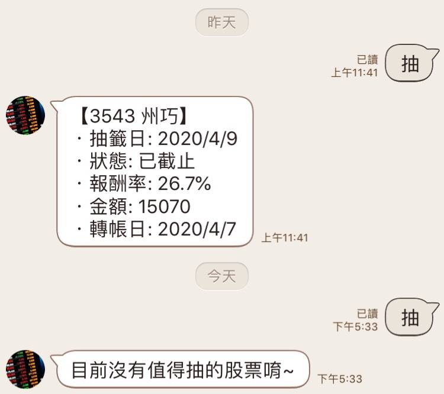
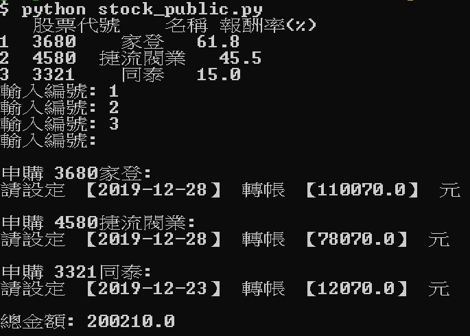

# 股票申購小幫手

## LINE Bot

* 點按圖文選單（或是輸入“抽”字）即可收到 **報酬率 > 10%** 的股票申購資訊

### Demo



### 加入好友
* @825wvemh 
* 或使用下方 QRcode


## Terminal version

```bash
$ git clone https://github.com/jumpingchu/Stock-LineBot.git
$ pip install -r requirements.txt
$ python stock_public.py
```

* 列出目前可申購 & 報酬率>10% 的股票代號與名稱
* Input: 使用者輸入欲抽的股票
* Output: 申購 XXXX股票: 請設定【日期】轉帳【金額】元
* 同時將 output 存入以當日日期為名稱的 txt 檔，做為紀錄

  

## 使用工具

* Python
* Django
* LINE Bot API
* ngrok (測試)
* Heroku (部署)

## 資料來源
* [HiStock](https://histock.tw/stock/public.aspx)

## 貢獻
* 目前功能只有這一個，開放提供想法和 Issue / PR
